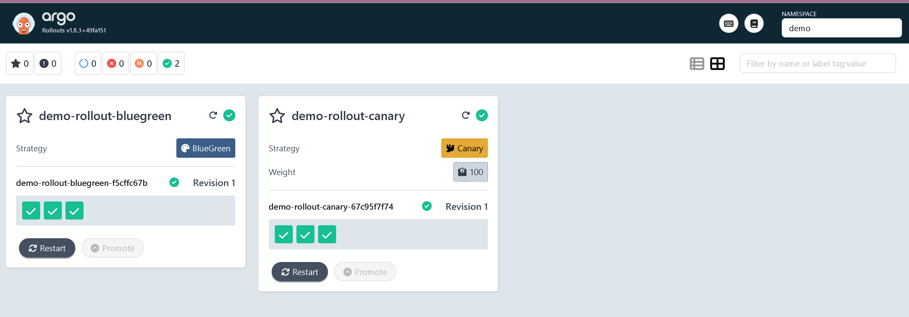

Project-08: Argo Rollouts – Advanced Deployment Strategies

This project demonstrates how to set up and use Argo Rollouts for advanced Kubernetes deployment strategies such as Blue-Green and Canary Deployments.

📌 Prerequisites

A running Kubernetes cluster (e.g., Minikube, Kind, or cloud-based)

kubectl configured to point to your cluster

Helm installed (optional, for advanced setups)

🔧 Installing Argo Rollouts
✅ Linux / Mac
kubectl apply -f https://github.com/argoproj/argo-rollouts/releases/latest/download/install.yaml
✅ Windows (PowerShell)

You need the kubectl-argo-rollouts CLI plugin.

Option 1: Browser Download (Recommended)

Go to the Argo Rollouts Releases page.

Download the asset named:

kubectl-argo-rollouts-windows-amd64

Rename it to:

kubectl-argo-rollouts.exe

Move it to a folder in your PATH (e.g., C:\Windows\System32\).

Option 2: PowerShell Download
[Net.ServicePointManager]::SecurityProtocol = [Net.SecurityProtocolType]::Tls12
Invoke-WebRequest `
  -Uri https://github.com/argoproj/argo-rollouts/releases/download/v1.8.3/kubectl-argo-rollouts-windows-amd64 `
  -OutFile kubectl-argo-rollouts.exe
Move-Item .\kubectl-argo-rollouts.exe C:\Windows\System32\
Verify Installation
kubectl-argo-rollouts version

You should see version information confirming the plugin is installed.

🚀 Deploying Example Rollout

Apply the Rollout and Service manifests:

kubectl apply -f rollout-demo.yaml
kubectl apply -f service-demo.yaml

Check rollout status:

kubectl-argo-rollouts get rollout demo-rollout

Promote rollout (for Canary strategy):

kubectl-argo-rollouts promote demo-rollout
📊 Observing the Rollout

Argo Rollouts provides a dashboard UI:

kubectl argo rollouts dashboard

This opens a local UI where you can track the deployment progression in real-time.

🌟 Key Learnings

Install and configure Argo Rollouts CLI

Use Blue-Green and Canary deployment strategies

Observe and promote rollouts interactively

Understand production-grade progressive delivery in Kubernetes